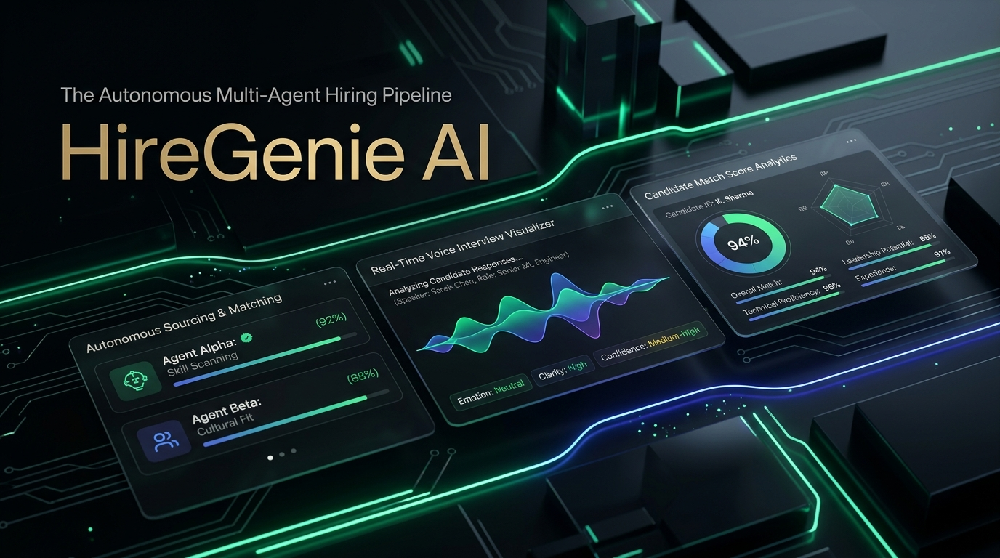
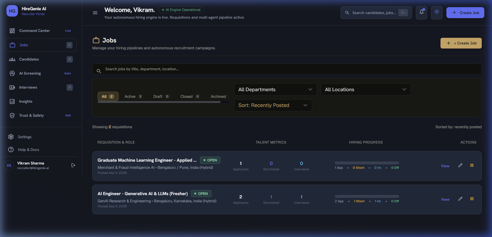
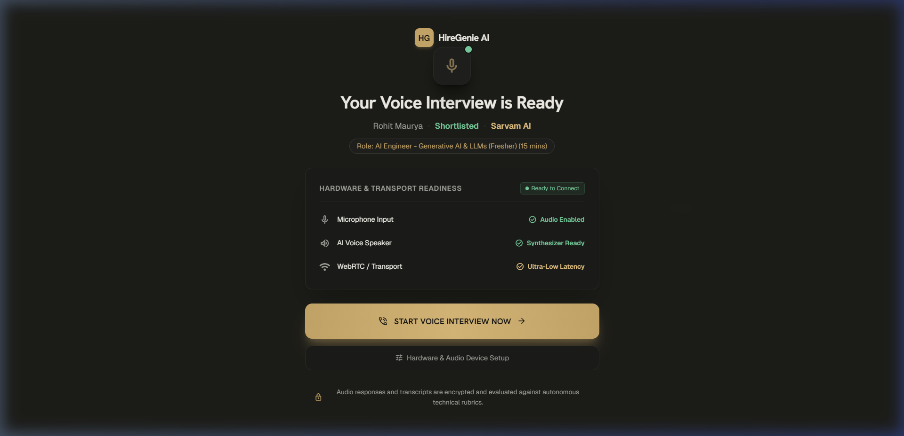
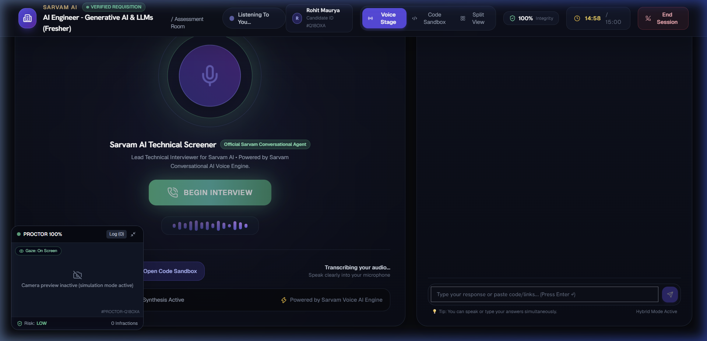
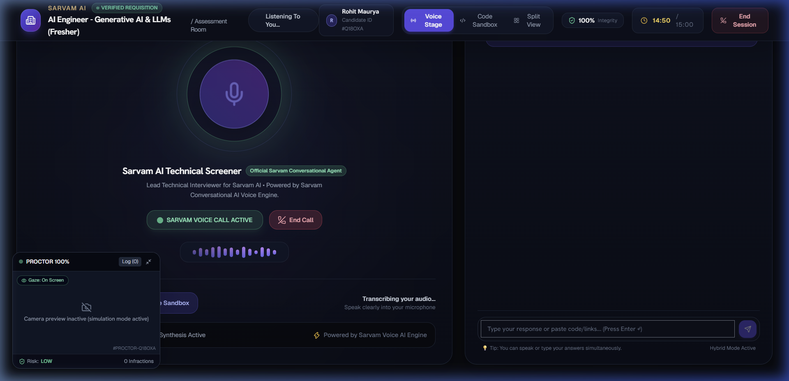
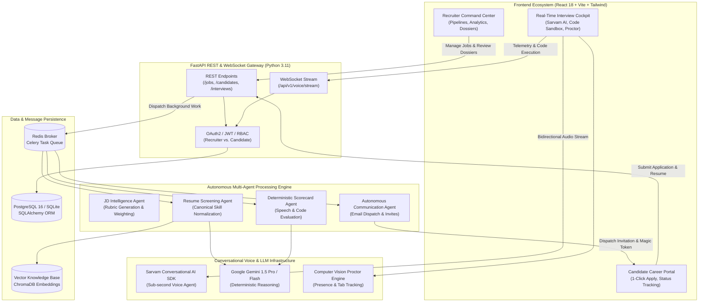

<div align="center">

# 🧞 HireGenie AI — Autonomous Recruitment & Talent Intelligence Platform
### *TalentOS: Production-Grade Autonomous Multi-Agent Hiring Operating System*

[](https://opensource.org/licenses/MIT)
[](https://www.python.org/)
[](https://fastapi.tiangolo.com/)
[](https://react.dev/)
[](https://www.typescriptlang.org/)
[](https://vitejs.dev/)
[](https://tailwindcss.com/)
[](https://www.sarvam.ai/)
[](https://www.docker.com/)

<br/>



<p align="center">
  <strong>Transforming hiring from fragmented manual reviews to deterministic, multi-agent AI execution.</strong><br/>
  Zero manual recruiter overhead • Real-time Voice AI Interview Room powered by Sarvam Conversational AI • Live Coding Sandbox • AI Proctoring • Automated Sourcing, Screening, and Offer Dispatch
</p>

[Explore Key Features](#-key-features--innovations) • [Visual Walkthrough](#-visual-walkthrough) • [System Architecture](#-system-architecture) • [Quickstart Guide](#-quickstart--local-development) • [API Documentation](#-api-documentation)

</div>

---

## 🌟 Executive Summary

**HireGenie AI (TalentOS)** is an autonomous hiring operating system designed for modern enterprises, high-growth startups, and recruitment agencies. By combining deterministic multi-agent pipelines with generative AI, conversational voice intelligence, and real-time WebRTC audio streaming, HireGenie AI delivers end-to-end recruitment execution without recruiter fatigue or human bias:

1. **Autonomous JD Intelligence**: Automatically synthesizes job descriptions, generates weighted scoring rubrics, and discovers candidate profiles across job boards and talent pools.
2. **Deterministic Screening & Skill Normalization**: Normalizes thousands of disparate tech skills using canonical ontologies and grades resumes against explicit, reproducible rubrics.
3. **Conversational Voice AI Interviews**: Features integrated in-browser voice interviews with **Sarvam Conversational AI**, providing sub-second speech-to-speech interaction with natural voice tone and vernacular flexibility.
4. **Live Coding Sandbox & Anti-Cheating Proctoring**: Enables candidates to write and test code in real time while an integrated computer-vision proctoring engine monitors for multi-person attendance and tab switching.
5. **Auditable Recruiter Command Center**: Provides recruitment leads with comprehensive candidate dossiers, audio scrubbers, transcript highlights, and automated offer letter generation.

---

## 📸 Visual Walkthrough

### 1. Recruiter Command Center & Job Requisitions
The command center gives recruiters an eagle-eye view of all active job requisitions, total applicant funnels, screening health, and shortlisting metrics.

<div align="center">
  
  <p><em>Figure 1: Recruiter Command Center featuring real-time Indian Tech talent requisitions, pipeline funnels, and shortlist status.</em></p>
</div>

---

### 2. Candidate Interview Verification & Hardware Readiness
Candidates verify their personal credentials, access tokens, and conduct real-time camera and microphone diagnostic checks before entering the secure interview environment.

<div align="center">
  
  <p><em>Figure 2: Candidate pre-interview check-in, system diagnostics, and role requirement briefing.</em></p>
</div>

---

### 3. Voice Interview Room with Integrated Code Sandbox & Proctoring
The interview suite combines an intuitive center-stage **"BEGIN INTERVIEW"** trigger, real-time speech transcription, live interactive code editor, and proactive anti-cheat detection.

<div align="center">
  
  <p><em>Figure 3: Clean, high-focus interview cockpit with instant audio engagement, question prompts, and editor.</em></p>
</div>

---

### 4. Active Sarvam Conversational Voice AI in Action
Once triggered, the high-fidelity Sarvam Conversational Voice AI agent conducts an autonomous, low-latency technical screening interview, adapting questions dynamically based on candidate responses.

<div align="center">
  
  <p><em>Figure 4: Real-time active Sarvam Conversational Voice AI streaming session with dynamic audio wave animations and conversational turns.</em></p>
</div>

---

## 🏗️ System Architecture

HireGenie AI operates on an event-driven, multi-tier architecture coordinating frontend micro-components, asynchronous Celery task workers, and specialized LLM / Voice AI models.



---

## ⚡ Key Features & Innovations

### 🎙️ 1. Sarvam Conversational Voice AI Integration
- **Zero-Latency In-Browser Audio**: Utilizes Sarvam AI's Conversational Web SDK to power bidirectional, low-latency audio interviews.
- **Center-Stage Action Trigger**: Elegant start controls that cleanly initialize microphone streams, WebRTC peers, and speech agents upon candidate readiness.
- **Multilingual & Vernacular Support**: Native fluency across Indian accents and vernacular languages (Hindi, Hinglish, English, etc.).
- **Live Interactive Transcript**: Real-time turn-by-turn speech transcription with candidate and interviewer speech tagging.

### 💻 2. Integrated Live Coding Sandbox
- **Multi-Language Support**: In-browser code editing for Python, JavaScript, TypeScript, Go, Java, and SQL.
- **Split-Screen Cockpit**: Candidates write, analyze, and discuss implementation logic side-by-side with the voice interviewer.
- **Real-time Code Telemetry**: Code snapshots are periodically evaluated and submitted to the scoring agent.

### 👁️ 3. Computer Vision AI Proctoring & Compliance
- **Real-Time Video Diagnostic**: Webcam feed checks for multiple persons in frame, unauthorized devices, or candidate absence.
- **Tab & Window Focus Auditing**: Automatically logs background tab-switch events and alerts recruiters in the interview scorecard.
- **Fairness & Bias Shield**: Real-time evaluation against the EEOC 4/5ths Disparate Impact Ratio rule to prevent algorithmic discrimination.

### 📄 4. Canonical Skill Normalization & Resume Screening
- **Ontology-Driven Parsing**: Resolves variant skill names (`react.js`, `ReactJS`, `React-JS` $\rightarrow$ `React`) into canonical taxonomies.
- **Weighted Rubric Scoring**: Dynamically calculates scores based on Core Must-Have Skills, Nice-To-Have Skills, and Relevant Industry Experience.
- **Automated Stage Funnel**: Candidates meeting the threshold score are automatically transitioned to `SHORTLISTED` and sent an interview invitation email.

### 📊 5. Comprehensive Recruiter Dossier & Offer Dispatch
- **360° Candidate Scorecard**: Evaluates Communication Clarity, Technical Competence, Problem Solving, and Culture Fit.
- **Audio Scrubber**: Allows recruiters to listen to specific segments of the interview playback alongside timestamped transcripts.
- **1-Click / Autonomous Offer Letter**: Auto-generates personalized offer letters with compensation structures, start dates, and role terms.

---

## 🛠️ Technology Stack

| Layer | Core Technologies | Description |
| :--- | :--- | :--- |
| **Frontend** | React 18, TypeScript, Vite, Tailwind CSS, Lucide React | Glassmorphism UI, responsive candidate & recruiter portals |
| **Backend API** | FastAPI, Pydantic v2, Python 3.11+, Uvicorn | High-performance asynchronous REST and WebSocket API gateway |
| **Voice & Speech AI** | Sarvam Conversational AI SDK, WebRTC Audio APIs | Real-time speech-to-speech dialog and low-latency audio streaming |
| **LLM & Reasoning** | Google Gemini 1.5 Pro / Flash, LangChain | Structured evaluation, resume parsing, and rubric generation |
| **Task Queue** | Celery, Redis Broker | Asynchronous, idempotent resume screening and email dispatch |
| **Database** | PostgreSQL 16 (Production) / SQLite (Development) | Relational data persistence with SQLAlchemy ORM and Alembic |
| **Vector Search** | ChromaDB / Sentence-Transformers | Semantic candidate search and JD embedding similarity |
| **DevOps & Containers** | Docker, Docker Compose | Production-ready multi-container orchestration manifests |

---

## 📁 Repository Structure

```
HireGenie-AI-Recruitment-Platform/
├── assets/                                   # Platform screenshots, banners, and diagrams
│   ├── hiregenie_hero_banner.jpg             # High-resolution platform banner
│   ├── recruiter_command_center.png          # Recruiter Jobs & Candidate funnel screenshot
│   ├── candidate_interview_entry.png         # Candidate check-in & verification view
│   ├── voice_interview_room.png              # Clean Voice Interview cockpit screenshot
│   └── sarvam_voice_active.png               # Active Sarvam Voice AI streaming session
├── backend/                                  # FastAPI application core
│   ├── app/
│   │   ├── api/v1/endpoints/                 # REST & WebSocket API route controllers
│   │   │   ├── analytics.py                  # Pipeline metrics & recruiter KPIs
│   │   │   ├── auth.py                       # JWT authentication & session handling
│   │   │   ├── interview.py                  # Interview sessions, tokens & Sarvam config
│   │   │   ├── jobs.py                       # Job requisitions & JD intelligence
│   │   │   ├── recruiter.py                  # Recruiter management & candidate dossiers
│   │   │   └── voice_ws.py                   # WebSocket stream for real-time audio
│   │   ├── core/                             # Security, configuration, RBAC & Gemini client
│   │   ├── db/                               # Database session engine & Base declarations
│   │   ├── models/                           # SQLAlchemy relational models
│   │   ├── schemas/                          # Pydantic validation schemas
│   │   ├── services/                         # Core pipelines (Screening, Sarvam, Analytics)
│   │   └── workers/                          # Celery task queue & asynchronous workers
│   ├── seed_fresher_jobs.py                  # Database seeder for real Indian AI Fresher roles
│   ├── requirements.txt                      # Python dependencies
│   ├── Dockerfile                            # Backend container configuration
│   └── docker-compose.yml                    # Multi-service local composition
├── frontend/                                 # React + Vite + TypeScript application
│   ├── src/
│   │   ├── components/                       # Modular UI components
│   │   │   ├── candidate/                    # Candidate journey cards & application views
│   │   │   ├── interview/                    # LiveCodeSandbox & AIProctoringOverlay
│   │   │   └── layout/                       # RecruiterSidebar, headers & navigation
│   │   ├── pages/                            # Full-page portal views
│   │   │   ├── RecruiterCommandCenter.tsx    # Recruiter main analytics dashboard
│   │   │   ├── RecruiterJobsPage.tsx         # Job requisition management
│   │   │   ├── CandidateHomePage.tsx         # Candidate careers browsing & 1-click apply
│   │   │   ├── InterviewEntryPage.tsx        # Hardware test & secure room check-in
│   │   │   └── VoiceInterviewRoomPage.tsx    # Live Sarvam Voice AI interview cockpit
│   │   ├── services/                         # Typed API client services
│   │   └── index.css                         # TalentOS Obsidian glassmorphism styles
│   ├── package.json                          # Node dependencies & build scripts
│   └── vite.config.ts                        # Vite configuration
├── README.md                                 # Comprehensive documentation & setup manual
└── LICENSE                                   # MIT License file
```

---

## 🚀 Quickstart & Local Development

### Prerequisites
- **Node.js**: v18.0+ & `npm`
- **Python**: v3.11+
- **Git**: Installed and configured

---

### 1. Clone the Repository

```bash
git clone https://github.com/HelloRohit26/HireGenie-AI-Recruitment-Platform.git
cd HireGenie-AI-Recruitment-Platform
```

---

### 2. Backend Setup (FastAPI)

```bash
# Navigate to backend directory
cd backend

# Create and activate Python virtual environment
python -m venv .venv

# On Windows:
.venv\Scripts\activate
# On Linux / macOS:
source .venv/bin/activate

# Install dependencies
pip install -r requirements.txt

# Configure environment variables
copy .env.example .env     # On Windows
cp .env.example .env       # On Linux/macOS

# Seed real Indian AI Fresher job requisitions (Optional but recommended)
python seed_fresher_jobs.py

# Launch FastAPI development server
uvicorn app.main:app --reload --host 0.0.0.0 --port 8000
```
> 📍 **FastAPI Swagger Docs**: Explore interactive API endpoints at `http://localhost:8000/docs`

---

### 3. Frontend Setup (React + Vite)

Open a new terminal window:

```bash
# Navigate to frontend directory
cd frontend

# Install dependencies
npm install

# Start Vite development server
npm run dev
```
> 📍 **Frontend Application**: Accessible at `http://localhost:3001` (or `http://localhost:5173`)

---

### 4. Running via Docker Compose

To spin up the entire production-grade stack (PostgreSQL, Redis, Celery, and Backend):

```bash
docker-compose -f backend/docker-compose.yml up --build -d
```

---

## ⚙️ Environment Variables Reference

Create a `.env` file in `backend/` based on `.env.example`:

| Variable | Description | Default / Example |
| :--- | :--- | :--- |
| `SECRET_KEY` | JWT signing secret | `your-secure-random-secret-key` |
| `DATABASE_URL` | SQLAlchemy connection string | `sqlite:///./hiregenie.db` *(or PostgreSQL URL)* |
| `SARVAM_API_KEY` | Sarvam AI API subscription key | `your_sarvam_api_key_here` |
| `GEMINI_API_KEY` | Google Gemini AI reasoning API key | `your_gemini_api_key_here` |
| `REDIS_URL` | Redis broker URL for task queues | `redis://localhost:6379/0` |
| `CELERY_TASK_ALWAYS_EAGER` | Run Celery tasks synchronously in dev | `True` *(set `False` for production)* |
| `SMTP_HOST` / `SMTP_USER` | Email dispatch credentials | `smtp.gmail.com` |

---

## 🧪 Testing & Code Quality Auditing

```bash
# Run comprehensive backend pipeline test
cd backend
python tests/test_real_agent_pipeline.py
python tests/test_candidate_journey_flow.py

# Run frontend production build check
cd frontend
npm run build
```

---

## 🔒 Security & Privacy

- **RBAC Enforcement**: Strict role-based access control segregating candidate and recruiter capabilities.
- **PII Redaction**: Personal identifying information is sanitized during screening to ensure objective evaluation.
- **Secure Tokenized Rooms**: Voice interview rooms require unique, cryptographic session tokens with expiration limits.
- **Auditable Decisions**: Every AI recommendation stores its underlying reasoning and evidence links in the database.

---

## 🤝 Contributing & Community

Contributions are welcome! Please follow these steps:
1. Fork the Project (`https://github.com/HelloRohit26/HireGenie-AI-Recruitment-Platform`)
2. Create your Feature Branch (`git checkout -b feature/AmazingFeature`)
3. Commit your Changes (`git commit -m 'feat: Add some AmazingFeature'`)
4. Push to the Branch (`git push origin feature/AmazingFeature`)
5. Open a Pull Request

---

## 📄 License

Distributed under the **MIT License**. See `LICENSE` for more information.

---

<div align="center">
  <sub>Developed with ❤️ by <a href="https://github.com/HelloRohit26">Rohit Maurya</a> & the HireGenie AI Engineering Team.</sub>
</div>
