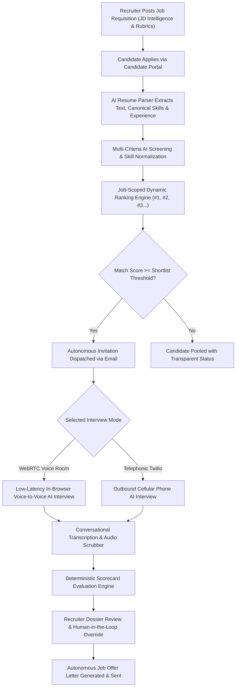

# 🚀 HireGenie AI — Autonomous Recruitment & Talent Intelligence Platform (TalentOS)

> **Award-Winning, Production-Grade Autonomous Multi-Agent Hiring Operating System**  
> *Zero Recruiter Manual Intervention • Real-Time WebRTC / Twilio Voice AI Interviews • Deterministic Evaluation & Fairness Auditing*

---

## 🌟 Executive Overview

**HireGenie AI** (TalentOS) is an enterprise-grade recruitment platform that automates the end-to-end talent acquisition lifecycle—from job description intelligence and multi-channel candidate sourcing to resume screening, candidate ranking, real-time voice-to-voice interviews, scorecard evaluation, and automated offer letter dispatch.



---

## 🏗️ Architecture & Technology Stack

### 🎨 Frontend Ecosystem (`frontend/`)
- **Core Framework**: React 18 with TypeScript and Vite
- **UI & Design Engine**: TalentOS Glassmorphism (Cyber Obsidian `#03040a` Dark Mode & Luxury Off-White Light Mode)
- **Styling**: Tailwind CSS & Vanilla CSS Design Tokens
- **Motion & Micro-interactions**: Framer Motion spring physics & dynamic audio equalizer frequency bars
- **3D & Canvas**: HTML5 High-DPI Data Rain Canvas & Spline 3D Hero Background
- **Audio & Media**: WebRTC Audio Stream with real-time waveform visualization

### ⚙️ Backend Ecosystem (`backend/`)
- **API Framework**: FastAPI (Python 3.11+) with Pydantic v2 schemas
- **Database Layer**: SQLAlchemy ORM with SQLite (Development) and PostgreSQL 16 (Production)
- **Durable Task Queue**: Celery with Redis broker and idempotent retry policies
- **AI & Reasoning**: Google Gemini AI with canonical skill normalization
- **Trust & Safety**: RBAC dependency injection, Disparate Impact Ratio / Fairness monitoring, and audit log middleware

---

## 📁 Repository Structure

```
├── README.md                                 # Complete documentation & quickstart guide
├── design.md                                 # TalentOS UI design system & token specifications
├── MASTER_FRONTEND_PROMPT.md                 # UI screen & workflow prompt specifications
├── docker-compose.production.example.yml     # Production Docker Compose orchestration manifest
├── docs/                                     # System audits, batch reports, and architecture plans
├── stitch_hiregenie_ai_talentos/             # Original Stitch UI screen inventory
├── frontend/                                 # React + TypeScript + Vite application
│   ├── index.html                            # Application entry HTML
│   ├── package.json                          # Frontend dependencies & scripts
│   ├── vite.config.ts                        # Vite configuration
│   ├── tsconfig.json                         # TypeScript compiler settings
│   ├── tests/                                # Frontend test suite
│   └── src/
│       ├── App.tsx                           # Main layout & portal router
│       ├── index.css                         # Design tokens, cyber animations & Tailwind directives
│       ├── components/                       # Modular UI components (auth, recruiter, candidate, landing)
│       ├── pages/                            # Full-page portal views (20+ responsive screens)
│       ├── services/                         # Typed API client services
│       ├── context/                          # Authentication & global theme state
│       └── types/                            # TypeScript interfaces
└── backend/                                  # FastAPI application
    ├── Dockerfile                            # Production backend container build
    ├── docker-compose.yml                    # Local multi-service compose (Postgres + Redis + Celery)
    ├── requirements.txt                      # Python dependencies
    ├── alembic/                              # Database migration configurations
    ├── tests/                                # Comprehensive test suite (19 test files)
    └── app/
        ├── main.py                           # FastAPI application entrypoint & startup migrations
        ├── api/v1/endpoints/                 # Modular RESTful API route controllers
        ├── core/                             # Security, RBAC, Gemini client & skill normalizer
        ├── db/                               # Database session factory & base models
        ├── models/                           # SQLAlchemy relational database models
        ├── schemas/                          # Pydantic request/response validation schemas
        ├── services/                         # Core business logic & AI pipelines
        ├── tools/                            # Specialized utility helpers (e.g., voice tools)
        └── workers/                          # Celery application, task handlers & dispatcher
```

---

## 🚀 Quickstart & Setup Guide

### 1. Prerequisites
- **Node.js** (v18.0.0 or higher) & `npm`
- **Python** (v3.11 or higher)
- **Redis** *(optional for durable task queue; in-memory eager mode available)*

---

### 2. Backend Setup

```bash
# Navigate to backend directory
cd backend

# Create and activate virtual environment
python -m venv .venv
# On Windows:
.venv\Scripts\activate
# On Linux/macOS:
source .venv/bin/activate

# Install dependencies
pip install -r requirements.txt

# Create environment configuration
cp .env.example .env

# Start FastAPI server
uvicorn app.main:app --reload --host 0.0.0.0 --port 8000
```
> 📍 **Backend API Documentation**: Available at `http://localhost:8000/docs` (Swagger UI) and `http://localhost:8000/redoc`.

---

### 3. Frontend Setup

```bash
# Navigate to frontend directory
cd frontend

# Install Node dependencies
npm install

# Start Vite development server
npm run dev
```
> 📍 **Frontend Application**: Available at `http://localhost:5173` (or port assigned by Vite).

---

### 4. Running with Docker Compose

```bash
# Start PostgreSQL, Redis, FastAPI Backend, and Celery Worker together:
docker-compose -f backend/docker-compose.yml up --build -d
```

---

## 🔑 Key Platform Features

| Feature Area | Description |
| :--- | :--- |
| **Recruiter Command Center** | Multi-agent live throughput metrics, application funnels, candidate dossiers, and audio scrubbers. |
| **Candidate Portal** | 1-click apply, dynamic application timeline, interview preparation sandbox, and live voice interview room. |
| **JD Intelligence** | AI-driven skill extraction, must-have vs. nice-to-have skill weighting, and JD quality scoring. |
| **Voice AI Interview Engine** | Real-time WebRTC audio streaming & Twilio telephonic dialer with live conversational AI prompts. |
| **Trust & Safety Monitoring** | Disparate Impact Ratio (4/5ths rule) bias detection, recruiter override logging, and immutable audit trail. |
| **Durable Task Queue** | Idempotent Celery task workers with exponential backoff for resume parsing, screening, and email delivery. |

---

## 🧪 Testing & Verification

```bash
# Run backend test suite
cd backend
.venv\Scripts\python.exe tests/test_real_agent_pipeline.py
.venv\Scripts\python.exe tests/test_candidate_journey_flow.py

# Verify frontend TypeScript build
cd frontend
npm run build
```

---

## 📄 License

This project is licensed under the MIT License. Developed for enterprise-scale autonomous recruitment operations.
