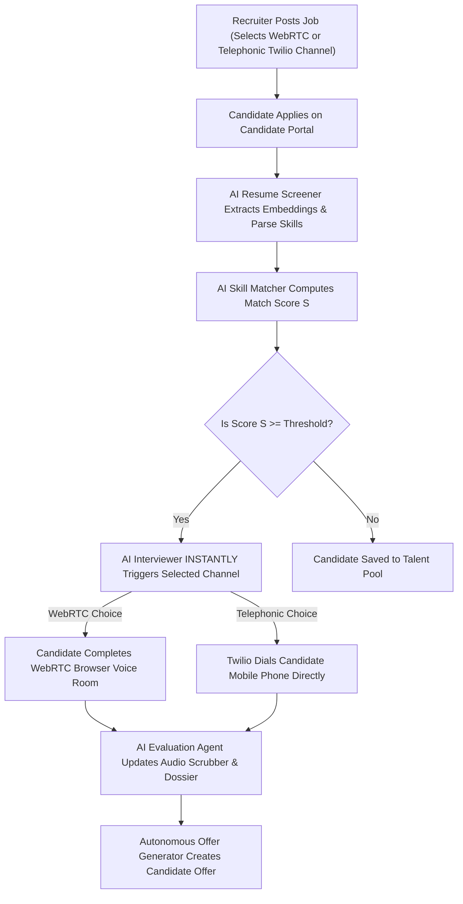

# 🎨 HireGenie AI – Frontend Design System & Architecture Specification (TalentOS UI)

> **Platform**: HireGenie AI – Autonomous Recruitment Platform  
> **UI Engine**: TalentOS Design System (Awwwards-Grade Glassmorphism & Framer Motion Engine)  
> **Target Audience**: Enterprise Recruiters & Job Seekers (Dual-Portal Ecosystem)  

---

## 🏛️ 1. DESIGN VISION & ARCHITECTURAL PHILOSOPHY

HireGenie AI is designed as a **Billion-Dollar, Award-Winning Production Platform**. The interface combines futuristic cyber-obsidian aesthetics with high-efficiency enterprise ergonomics.

### Key Pillars:
1. **Zero-Recruiter-Intervention Autonomous Pipeline**: Visual indicators and live streaming banners highlight that 100% of resume screening, candidate ranking, and WebRTC/Twilio telephonic interviews run autonomously without recruiter intervention.
2. **Dual Theme Mastery**:
   - **Dark Obsidian Mode**: Cyber-obsidian background (`#03040a`) with glowing 3D floating mesh orbs, laser particle cables, and neon accent glows.
   - **Warm Off-White Light Mode**: Comfortable lavender-tinted background (`#f4f5fa` / `#f1f3f9`) with soft card shadows, metallic accents, and crisp `#0f172a` typography (no stark pure white).
3. **Continuous Motion Graphics**: Flowing SVG particle cables, pulsing equalizer frequency bars, 3D card tilt hovers, and spring-physics transitions powered by **Framer Motion**.

---

## 🎨 2. COLOR PALETTE & DESIGN TOKENS

### Dark Mode Tokens (Obsidian Neon Glassmorphism)
- **Primary Background**: `#03040a` (Deepest Obsidian Space)
- **Glass Card Background**: `#0c0e1e` / `rgba(12, 14, 30, 0.85)` with `backdrop-blur-2xl`
- **Border Highlights**: `rgba(168, 85, 247, 0.25)` (Neon Purple Gradient Border)
- **Accent Gradients**:
  - **Purple/Pink**: `from-purple-600 via-pink-600 to-blue-600`
  - **Cyan/Blue**: `from-blue-500 to-cyan-400`
  - **Emerald/Teal**: `from-emerald-500 to-teal-400`
  - **Rose/Orange**: `from-rose-500 to-orange-400`

### Light Mode Tokens (Warm Luxury Off-White)
- **Primary Background**: `#f4f5fa` (Soft Lavender Gray)
- **Sidebar & Header**: `#f1f3f9` (Subtle Metallic Tint)
- **Glass Card Background**: `#ffffff` / `rgba(255, 255, 255, 0.95)` with soft shadow `shadow-slate-200`
- **Text Color**: `#0f172a` (Rich Dark Slate for maximum legibility)

---

## ⚡ 3. MOTION GRAPHICS & ANIMATION ENGINE

### CSS Keyframe Animations (`index.css`)
```css
/* Animated Flowing Laser Beam Cable */
@keyframes dash {
  from { stroke-dashoffset: 40; }
  to { stroke-dashoffset: 0; }
}

/* 3D Floating Mesh Particle Orbs */
@keyframes float-slow {
  0%, 100% { transform: translateY(0px) rotate(0deg); }
  50% { transform: translateY(-15px) rotate(3deg); }
}

/* Glowing Border Pulse */
@keyframes glow-pulse {
  0%, 100% { box-shadow: 0 0 20px rgba(168, 85, 247, 0.3); }
  50% { box-shadow: 0 0 40px rgba(168, 85, 247, 0.6); }
}
```

### Framer Motion Micro-Interactions
- **Candidate Motion Cards**: `whileHover={{ scale: 1.04, y: -6 }}` with `type: "spring", stiffness: 300, damping: 22`.
- **Page Entrance Transitions**: Staggered list fade-in with slide-up offset (`initial={{ opacity: 0, y: 25 }}`).
- **Equalizer Frequency Bars**: Dynamic height pulsing animation on active AI Agent cards and Twilio telephonic call modals.

---

## 🧩 4. FRONTEND COMPONENT HIERARCHY

```
frontend/src/
├── App.tsx                        # Fullscreen Layout Wrapper & Portal Switcher
├── index.css                      # Global Tailwind directives & Motion keyframes
├── api/
│   └── services.ts                # Axios API Service Layer for Jobs, Candidates, Auth & Voice
├── components/
│   ├── auth/
│   │   └── AuthModal.tsx          # Recruiter vs Candidate Role-Based Auth & Demo Login
│   ├── candidate/
│   │   └── CandidatePortalView.tsx # Candidate Discovery Feed, Application & Magic Interview Link
│   ├── interview/
│   │   ├── VoiceInterviewRoomModal.tsx # WebRTC Speech-to-Speech Voice Room Tester
│   │   └── TelephonicCallModal.tsx     # Twilio Direct Outbound Cellular Call Tester
│   └── recruiter/
│       ├── TalentOSDashboard.tsx  # Main Recruiter Command Center (Header, Agents, Funnel, Charts)
│       ├── Sidebar.tsx            # Left 9-Item Navigation Sidebar with Theme Toggle
│       ├── AIAgentStreamCard.tsx  # Multi-Agent Live Throughput Cards & Laser Cables
│       ├── LiveActivityFeed.tsx   # Right Sidebar Real-Time Activity Stream & Event Simulator
│       ├── CandidateDossierModal.tsx # Candidate Profile Dossier with Audio Scrubber & Scores
│       └── JobCreationWizardModal.tsx # 3-Step Role Creation Wizard with WebRTC/Twilio Choice
```

---

## 📐 5. COMPONENT DESCRIPTIONS & LAYOUT ARCHITECTURE

### 1. `App.tsx` – Fullscreen Edge-to-Edge Container
- **Layout**: `w-full min-h-screen bg-[#03040a] overflow-x-hidden`.
- **Header Control Strip**: Displays user badge (`Rohit Maurya (RECRUITER)`), portal switcher buttons (`TalentOS Recruiter` vs `Candidate Portal`), and logout control.

### 2. `TalentOSDashboard.tsx` – Recruiter Command Center
- **Autonomous AI Hero Banner**: `⚡ 100% AUTONOMOUS AI PIPELINE: Zero Recruiter Manual Intervention Required`.
- **SVG Laser Particle Stream Cable**: Glowing cable connecting 5 AI Agent Cards (`Resume Screener` ➔ `Skill Matcher` ➔ `Candidate Ranker` ➔ `Interview Scheduler` ➔ `Offer Generator`).
- **Top Candidate Motion Grid**: Displays match scores ($96\%$, $93\%$), experience badges, skill chips, `Twilio Call` trigger, and `View Dossier` buttons.
- **Analytics & Funnel**:
  - Chevron Hiring Pipeline Funnel (`Applied: 2,543` ➔ `Hired: 15`).
  - Applications Over Time SVG Line Chart (`↗ 24.5%`).
  - AI Match Score Circular Donut Gauge (`89% Excellent Match`).
  - Sources Performance Progress Bars (`LinkedIn 45%`, `Company Careers 25%`, `Referral 15%`, `Others 15%`).

### 3. `Sidebar.tsx` – Navigation & Theme Control
- **Logo Header**: `AI Recruiter` branding with gradient icon.
- **9 Menu Items**: `Dashboard`, `Jobs`, `Candidates`, `AI Agents`, `Interviews`, `Analytics`, `Messages (Badge: 12)`, `Calendar`, `Settings`.
- **Theme Switcher**: One-click toggle between `Dark Theme` and `Light Theme`.
- **Admin Profile Widget**: Profile avatar with green online status dot.

### 4. `LiveActivityFeed.tsx` – Real-Time Event Timeline
- **Header**: Live ping dot + `Stream Event` simulator button.
- **Category Filter Chips**: `ALL`, `SCREENER`, `INTERVIEW`, `RANKER`.
- **Activity Items**: Real-time event cards with Framer Motion slide-in animations.

### 5. `TelephonicCallModal.tsx` – Twilio Direct Phone Call
- **Cellular Phone Dialer**: Input for candidate phone number (`+91 98765 43210`).
- **Live State Machine**: `QUEUED` ➔ `RINGING` ➔ `TWILIO CONNECTED` ➔ `AI EVALUATING` ➔ `COMPLETED`.
- **Radar Equalizer**: Green audio frequency bars + real-time phone speech transcript stream.

### 6. `JobCreationWizardModal.tsx` – Role Posting Wizard
- **Step 1**: Role details (Title, Company, Salary, Skills).
- **Step 2**: AI Agent Channel Selection (**WebRTC Browser Room** vs **Telephonic Twilio Call**).
- **Step 3**: Role-Specific Custom Screening Questions with skill weight multipliers.

---

## 🔄 6. END-TO-END AUTONOMOUS USER FLOW



---

## 🛠️ 7. HOW TO RUN THE FRONTEND DESIGN

1. **Install Dependencies**:
   ```bash
   cd frontend
   npm install
   ```
2. **Start Development Server**:
   ```bash
   npm run dev
   ```
3. **Verify TypeScript Compilation**:
   ```bash
   npx tsc --noEmit
   ```
