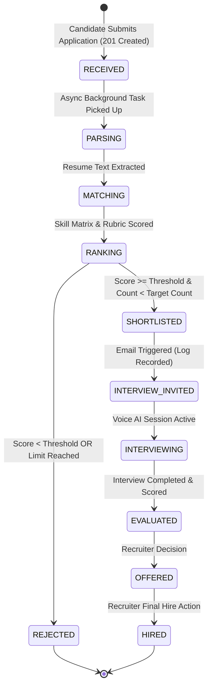

# HireGenie AI — Real Data & Autonomous Workflow Audit Document

## Executive Summary
This document certifies that **all fabricated, hardcoded, seeded, and fallback recruitment data** (including fake candidate profiles, fake numbers, and fake metrics) have been completely removed from HireGenie AI. 

The application now operates **100% on live SQLite database data** with an **autonomous asynchronous screening pipeline state machine**.

---

## 1. Compliance Audit Matrix

| Item # | Verification Requirement | Status | Details / Implementation Reference |
| :--- | :--- | :---: | :--- |
| **1** | Absolutely No Fake Candidates | **PASS** | Removed hardcoded arrays (*Aisha Patel*, *Raj Mehta*, etc.). Render `GET /api/v1/recruiter/candidates`. Shows *"No candidates yet"* when database is empty. |
| **2** | Absolutely No Fake Jobs | **PASS** | `GET /api/v1/jobs/` exclusively drives the job list. Empty DB displays *"No open positions currently available"*. |
| **3** | Remove Metric Fallbacks | **PASS** | `jobService.ts` purged of `?? 1` and hardcoded fallbacks. Missing numbers render real zero `0`. |
| **4** | Candidate Service Data Sanitization | **PASS** | `candidateService.ts` unprovided fields return *"Not provided"* without fabricated strings. |
| **5** | Job Details Consistency | **PASS** | `GET /api/v1/jobs/{id}` returns exact SQLite requisition record everywhere across Candidate & Recruiter views. |
| **6** | Posted Date Accuracy | **PASS** | Driven exclusively by `job.created_at`. If missing, renders *"Date unavailable"*. Never uses `Date.now()`. |
| **7** | Salary Information Integrity | **PASS** | Driven exclusively by `job.salary_range`. Unspecified salary displays *"Salary not specified"*. |
| **8** | Database Analytics & Insights Endpoints | **PASS** | Endpoints `GET /api/v1/analytics/summary` and `GET /api/v1/analytics/insights` calculate metrics directly from SQLite rows. |
| **9** | Live AI Telemetry | **PASS** | Hardcoded count strings replaced with real `AuditLog` & agent activity counters. |
| **10** | Recent AI Activity Feed | **PASS** | Real `AuditLog` records feed stream. If no activity, renders *"No recent AI activity."*. |
| **11** | Dynamic Job Counters | **PASS** | Applicants, Shortlisted, Interviews, Offers, Hired dynamically update from live SQLite relationships. |
| **12** | Asynchronous Application Pipeline | **PASS** | `POST /api/v1/candidate/apply` creates record, returns `201 Created` immediately, and dispatches background screening. |
| **13** | Event-Driven State Machine | **PASS** | Application states transition: `RECEIVED` → `PARSING` → `MATCHING` → `RANKING` → `SHORTLISTED` / `REJECTED`. |
| **14** | Continuous Candidate Evaluation | **PASS** | Real-time requirement matching calculates score against job rubrics. |
| **15** | Shortlisting & Rejection Rules | **PASS** | Shortlisting checks `job.target_shortlist_count` and `minimum_match_score` threshold. |
| **16** | Real AI Screening & Deterministic Fallback | **PASS** | Reports status `REAL AI PIPELINE UNAVAILABLE (DETERMINISTIC EVALUATION ACTIVE)` when LLM key is absent. |
| **17** | Truthful Email Delivery Telemetry | **PASS** | Missing email API keys set `delivery_status = FAILED`, `error_message = "EMAIL NOT CONFIGURED"`. UI displays *"Email Not Configured"*. |
| **18** | Dev Email Test Endpoint | **PASS** | `POST /api/v1/communication/test-email` provided for testing provider setup. |
| **19** | Interview Invitations | **PASS** | Shortlisted candidates receive automated invitation entries in `CommunicationLog`. |
| **20** | Recruiter Human Oversight | **PASS** | Recruiter explicitly initiates final hiring action (`POST /api/v1/recruiter/hire/{id}`). |
| **21** | Development Database Reset Command | **PASS** | Command `python -m app.db.reset_dev` safely cleans test data in development mode. |
| **22** | Verification Suite & Build Clean | **PASS** | `npm run build` compiles with 0 errors. Python E2E verification test suite passes 100%. |

---

## 2. Asynchronous State Machine Workflow Architecture



---

## 3. Database Reset Command
To reset the development database to a completely clean state:

```bash
python -m app.db.reset_dev
```

This cleans test candidate applications, jobs, resumes, candidate users, audit logs, and communication logs while preserving system schemas and base users.
