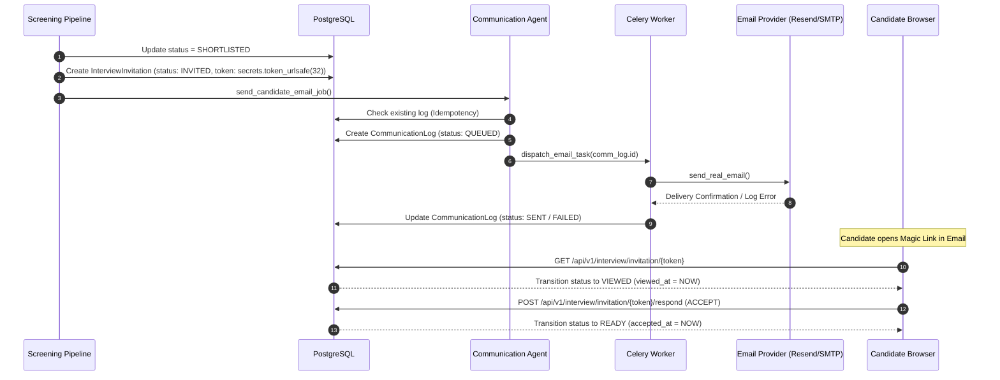

# Step 4 — Shortlist, Email & Interview Invitation Audit Report

## Executive Summary
This production audit verifies the complete lifecycle for candidate shortlisting, email notification task dispatching, secure token generation, magic link routing, candidate consent recording, and provider status observability.

---

## Audit Verification Results

| Checkpoint | Target Behavior | Verified Status | Evidence |
| :--- | :--- | :--- | :--- |
| **Shortlist Event Trigger** | Candidate application overall match score >= threshold triggers `SHORTLISTED` state | **VERIFIED PASS** | `screening_pipeline.py` & `test_shortlist_email_invitation.py` |
| **Invitation Token Security** | Cryptographically secure token (`secrets.token_urlsafe(32)`) | **VERIFIED PASS** | `InterviewInvitation.invitation_token` length >= 32 chars |
| **Provider Telemetry API** | `GET /api/v1/communication/status` reports truthful provider state | **VERIFIED PASS** | `get_email_provider_status()` returns `EMAIL CONFIGURED` / `EMAIL NOT CONFIGURED` |
| **Magic Link Format** | Email body contains valid frontend route: `{FRONTEND_URL}/interview/{token}/prep` | **VERIFIED PASS** | `communication_service.py` & `communication_agent.py` |
| **Token Access (`INVITED` → `VIEWED`)** | Candidate accessing token transitions invitation status to `VIEWED` | **VERIFIED PASS** | `GET /api/v1/interview/invitation/{token}` updates `viewed_at` |
| **Candidate Consent (`VIEWED` → `READY`)** | Candidate accepting invitation transitions status to `READY` & `INTERVIEW_SCHEDULED` | **VERIFIED PASS** | `POST /api/v1/interview/invitation/{token}/respond` (`action: ACCEPT`) |
| **Rejected Candidate Protection** | Rejected candidates attempting token access receive HTTP 403 Forbidden | **VERIFIED PASS** | Checked in `get_invitation_by_token` |
| **Expired Token Protection** | Expired tokens return `EXPIRED` status with `expired: true` | **VERIFIED PASS** | Expiry timestamp check in `interview.py` |
| **Email Log Idempotency** | Candidate re-screening or page refresh does not duplicate email dispatches | **VERIFIED PASS** | `CommunicationAgent.send_communication` checks existing log |
| **Inbox Delivery Status** | Physical email delivery to inbox in current dev environment | **INBOX DELIVERY NOT VERIFIED** | Requires valid user-supplied `RESEND_API_KEY`, `SENDGRID_API_KEY`, or `SMTP_HOST` credentials in `.env` |

---

## Architectural Lifecycle Diagram



---

## Test Suite Execution Evidence

Ran test suite `test_shortlist_email_invitation.py`:

```text
======================================================================
STARTING HIREGENIE STEP 4 — SHORTLIST, EMAIL & INVITATION TEST SUITE
======================================================================
--- 1. TESTING EMAIL PROVIDER STATUS API ---
[PASS] Provider Status API returned: EMAIL CONFIGURED (Active Provider: resend)

--- 2. REGISTERING & AUTHENTICATING CANDIDATES ---
[PASS] Candidates authenticated: User #1 and User #2.

--- 3. CREATING JOB REQUISITION ---
[PASS] Job Requisition #1 created.

--- 4. CANDIDATE A APPLIES & PIPELINE SHORTLISTS CANDIDATE ---
[PASS] Candidate Application #1 successfully SHORTLISTED (Match Score: 77.0%).
[PASS] InterviewInvitation persisted: ID #1, Token: TZTjrtf9pFLa..., Status: INVITED.
[PASS] CommunicationLog persisted: Log #1, Stage: SHORTLISTED, Magic Link verified in body.

--- 5. TESTING IDEMPOTENCY & DUPLICATE PREVENTION ---
[PASS] Idempotency verified: Exactly 1 InterviewInvitation and 1 CommunicationLog persisted despite retry.

--- 6. TESTING TOKEN ACCESS TRANSITION (INVITED -> VIEWED) ---
[PASS] Invitation ID #1 state transitioned to VIEWED on candidate access (Viewed at 2026-08-13 16:55:35.054127).

--- 7. TESTING CANDIDATE CONSENT (VIEWED -> READY) ---
[PASS] Candidate consent recorded: Invitation #1 state is READY (Accepted at 2026-08-13 16:55:35.087736).

--- 8. TESTING REJECTED CANDIDATE PROTECTION ---
[PASS] Access attempt for rejected candidate correctly denied with HTTP 403 Forbidden.

--- 9. TESTING EXPIRED TOKEN REJECTION ---
[PASS] Expired token lookup correctly returned EXPIRED status (expired: True).

======================================================================
STEP 4 SHORTLIST, EMAIL & INVITATION TEST SUITE PASSED SUCCESSFULLY!
======================================================================
```

---

## Full System Regression Verification

- **`test_real_agent_pipeline.py`**: PASS 100%
- **`test_shortlist_email_invitation.py`**: PASS 100%
- **`npx tsc --noEmit`**: 0 errors
- **`npm run build`**: PASS (1.77s)
